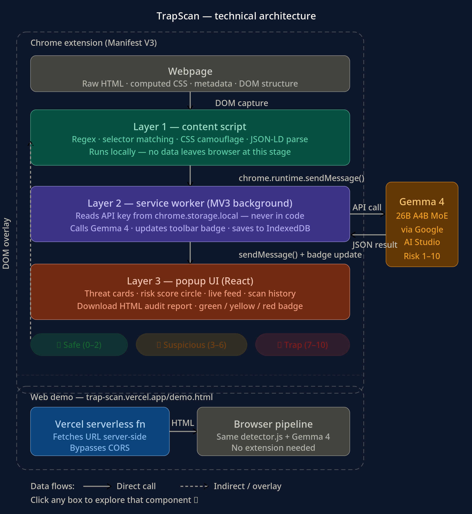

# TrapScan

> The web is no longer safe for AI agents.

TrapScan is a browser-native defense layer for AI agents. It detects adversarial content before your agent gets hijacked, combining local pattern detection with Gemma-powered classification for suspicious findings.

## What it does

TrapScan scans pages for AI Agent Traps, including:

- Content injection
- Semantic manipulation
- Cognitive state attacks
- Behavioral control
- Systemic traps
- Human-in-the-loop attacks

It runs initial detection in the browser, then uses Gemma to classify suspicious fragments and explain the threat in plain English.

## Live Demo & Links

- **Web App & Live Scanner**: [https://trap-scan.vercel.app/demo.html](https://trap-scan.vercel.app/demo.html)
- **Product Landing Page**: [https://trap-scan.vercel.app](https://trap-scan.vercel.app)
- **GitHub Repository**: [https://github.com/PuneetKumar1790/TrapScan](https://github.com/PuneetKumar1790/TrapScan)

## Why it matters

AI agents are browsing, reasoning, and taking actions on behalf of users. That creates a new attack surface: the information environment itself.

TrapScan is built for that reality.

## Architecture



TrapScan operates in three layers:

**Layer 1 — Content Script** runs on every page at document idle. 
Captures raw HTML, CSS, metadata and DOM. Runs 6 detection algorithms 
locally — no data leaves the browser.

**Layer 2 — Service Worker** receives suspicious fragments via 
chrome.runtime.sendMessage(). Reads Gemma 4 API key from 
chrome.storage.local and calls gemma-4-26b-a4b-it via Google AI Studio. 
Updates toolbar badge in real time.

**Layer 3 — Popup UI** (React) renders threat cards, risk score, 
live feed, and scan history. Generates downloadable HTML audit reports.

**Web Demo** adds a Vercel serverless function that fetches URLs 
server-side to bypass CORS, then runs the same detection pipeline 
client-side — no extension install needed.

## Core features

- Real-time page scanning
- Local pattern matching in the content script
- Gemma-based threat classification
- Risk scores from 1–10
- Plain-English explanations
- Downloadable scan reports
- Scan history and stats
- Chrome extension popup with Scan, Feed, History, and Settings

## CS concepts used

TrapScan combines several core computer science concepts:

- DOM traversal and CSS computed style analysis to detect visual camouflage attacks such as colour matching and negative positioning
- Regex pattern matching across raw HTML to catch comment injection and jailbreak keyword detection
- JSON-LD schema parsing to identify cognitive state attacks embedded in structured data
- Chrome Manifest V3 service worker architecture to maintain event-driven background processing across tabs using chrome.storage.local and IndexedDB
- Gemma 4 large language model reasoning for semantic understanding, complementing local signature matching with intent detection

Together, these techniques help TrapScan stay robust against both known attack patterns and novel variations.

## Research-backed foundation

TrapScan is inspired by the AI Agent Traps research from Google DeepMind researchers Franklin et al. (2025).

Research paper:
https://papers.ssrn.com/sol3/papers.cfm?abstract_id=6372438&trk=feed-detail_comments-list_comment-text

## Installation

### 1. Install dependencies

```bash
npm install
```

### 2. Configure environment

Copy the example env file and add your Gemma API key:

```bash
cp .env.example .env
```

Set these values for the default Gemma model:

```dotenv
VITE_MODEL_PROVIDER=google
VITE_MODEL_NAME=gemma-4-26b-a4b-it
VITE_MODEL_BASE_URL=https://generativelanguage.googleapis.com
VITE_GEMMA_API_KEY=your_api_key_here
```

### 3. Build the extension

```bash
npm run build
```

### 4. Load in Chrome

- Open `chrome://extensions`
- Enable Developer mode
- Click Load unpacked
- Select the `dist/` folder

The Add to Chrome buttons on the site open the GitHub repo. Use the steps above to load the unpacked `dist/` build into Chrome.

## Using the extension

- Open any page or one of the included demo pages
- TrapScan scans for suspicious patterns automatically
- Open the popup to review detections, history, and settings
- Add your Gemma API key in Settings if needed

## Demo pages

The repo includes sample adversarial pages for testing:

- `demo-pages/content-injection.html`
- `demo-pages/behavioural-control.html`
- `demo-pages/cognitive-state.html`
- `demo-pages/semantic-manipulation.html`

## Gemma model

TrapScan is configured to use:

- Provider: `google`
- Model: `gemma-4-26b-a4b-it`
- Base URL: `https://generativelanguage.googleapis.com`

If you change the model values, rebuild the project after updating `.env`.

## API key setup

Get a Gemma API key from Google AI Studio and paste it into TrapScan Settings.

For local testing, store it in `.env` as `VITE_GEMMA_API_KEY`.

## Project layout

- `background/` — service worker and message routing
- `content/` — page-level detection logic
- `popup/` — React-based extension UI
- `demo-pages/` — adversarial test pages
- `utils/` — detection, Gemma integration, reporting, storage

## Build output

The production bundle is generated in `dist/` and is ready to load as an unpacked Chrome extension.

## License

MIT
